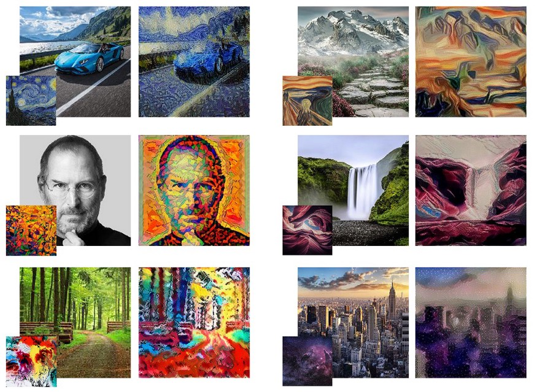
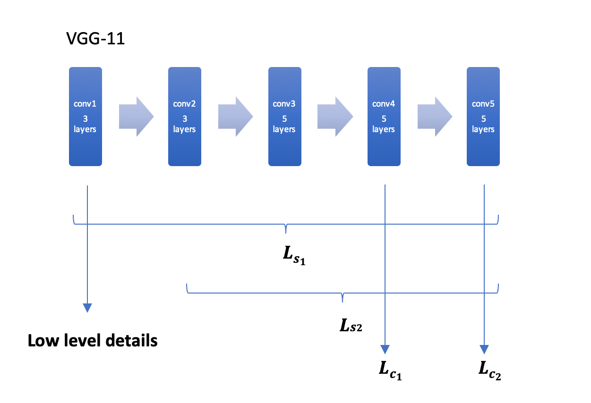
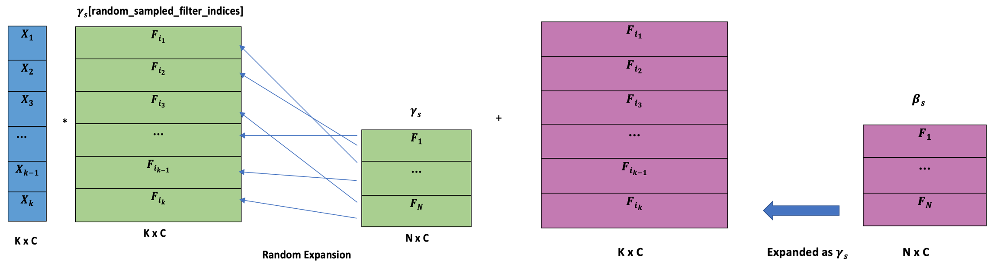

**Richard Li, Zhaoyi Zhang, Yizhou Liu**

# Motivation

Our project is largely based on NST (neural style transfer). NST builds on the idea that it is possible to separate the style representation and content representations in a CNN trained for a computer vision task. NST employs a pre-trained convolutional neural network (CNN) to transfer styles from a given image to another. In detail, it is an optimization technique used to take three images, a content image, a style image (such as an artwork by a famous painter) — and blend them together such that the input image is transformed to look like the content image, but “painted” in the style of the style image. In the picture below, you can see, for example, the Lamborghini painted in the style of The Starry Night by Van Gogh, the mountain painted in the style of the paint The Scream by Edvard Munch.

However, NST is usually applied to the whole content image with the same style. For more practical uses of NST, we want to achieve the effect that we only stylize desirable human entities in the image, and even more, apply different styles to different human entities separately, while preserving most of the details of the human entities. Because it is very likely that different people have different tastes and want to apply different filters to themselves. We found that it is possible to train a feed forward neural network, such that the content image can be stylized in a single fast forward pass. However, a separate neural network need to be trained to apply a different style. Thus, we implemented neural style transfer with conditional instance normalization, which allow us to apply different styles with a single neural network.

To summarize, our project goal is:

> For a given input image with k instances, we want to generate an output image where k instances are applied with different theme filters individually selected by the user.

# Theory Base

Our theme rendering approach is partially based on *A Learned Representation For Artistic Style* by Dumoulin et al (2017).

We re-designed the following parts:

1. Pastiche model Architecture
2. Model selection for feature extraction
3. Layer selection for content and style loss computation
4. conditional instance normalization scheme
5. Balancing weights $$\lambda_s$$ and $$\lambda_c$$

# Approach

To apply filters on different objects in an image separately, we used a pre-trained R-CNN to generate a mask for each instance, and apply the chosen themems on the masked image.

Main models we build: Pastiche model, VGG11

Pastiche model: The model we build for theme rendering. Trained on coco2017 dataset and nine theme images.

VGG11: Pre-trained on ImageNet. We divide it into five blocks and use them for feature extraction to compute losses with the ones trained with Pastiche model.

Loss functions:

$$
\mathcal{L}_S(p)=\sum_{i\in S}\frac{1}{U_i}\lvert\lvert G(\phi_i(p))-G(\phi_i(s))\rvert\rvert^2_F
$$

$$
\mathcal{L}_c(p)=\sum_{j\in S}\frac{1}{U_j}\lvert\lvert \phi_j(p)-\phi_j(c)\rvert\rvert^2_2
$$

$$
\mathcal{L(s,c)}=\lambda_s\mathcal{L}_s(T(c))+\lambda_c\mathcal{L}_c(T(c))
$$

**A snapshot of feature extraction blocks for loss computation**

**Content loss style loss computed in different ways:**

$$L_{s_1}$$: Style transfer (with textures and noise transferred)

$$L_{s_2}$$: Theme rendering (with less textures and more high-level layout and color patterns)

$$L_{c_1}$$: Loss computed with lower abstraction of content images in training compared to $$L_{c_2}$$, and with most of features in original instances preserved.

$$L_{c_2}$$: Loss computed with higher abstraction of content images in training compared to $$L_{c_1}$$, and with less features in original instances preserved.

**Conditional Instance Normalization with cell expansion**

CIN formula:

$$
z=\gamma_s\left(\frac{x-\mu}{\sigma}\right)+\beta_s
$$

Advantages: 

- Reduce training time in a large margin.

- Input one image, and output multiple theme rendered images with different selected filters in one forward pass.

- Multi-object theme rendering with different filters

**Training time random theme blending (our first idea)**

- $$
  \mathcal{L}_S(p)=\sum_{i\in S}\sum_{x,y\in X,Y}\frac{1}{U_i}\lvert\lvert G(\phi_i(p_{x,y}))-G(\phi_i(s_{x,y}))\rvert\rvert^2_F
  $$

  - As above, for each ROI with coordinate $$(x, y)$$, a filter $$i$$ is applied $$(i <- (x, y))$$ to compute patch-wise loss respectively and add them together.

Challenge:

- Unstable results (ROI for each training image is different). Slow to train.

**Inference time instance segmentation:**

To save training time, we use a pre-trained Mask-RCNN model from torchvision to compute the masks for ROI (main instances in an image) at the inference time.

**Filtering level:**

For tuning weighing parameters $$L_s$$ and $$L_c$$, we fix $$L_c=L_{c_0}$$, initialize $$L_s=L_{s_0}$$, and introduce a degree parameter $$\varepsilon$$ to tweak $$L_s=L_s\times10^\varepsilon$$. In fact, the parameters for filtering are difficult to tune, and sensitive to the change of architecture and hyperparameters. We found that $$\varepsilon$$ between 2.2 to 3.0 is a good range.

# Results Demo

# Discussion

$$
\mathcal{L}_c(p)=\sum_{j\in C}\sum_{x,y\in S}\lambda_{x,y}\frac{1}{U_j}\lvert\lvert \phi_j(p_{x,y})-\phi_j(c_{x,y})\rvert\rvert^2_2
$$

One open question is that to preserve even further small area-specific details while applying filters, we could explore using above scheme. $$\lambda$$ can be applied to ROIs in a pixel level while applying filters.
